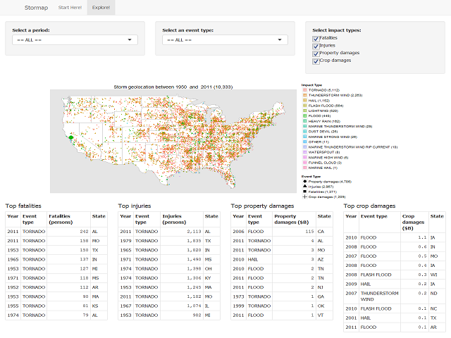
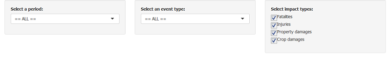
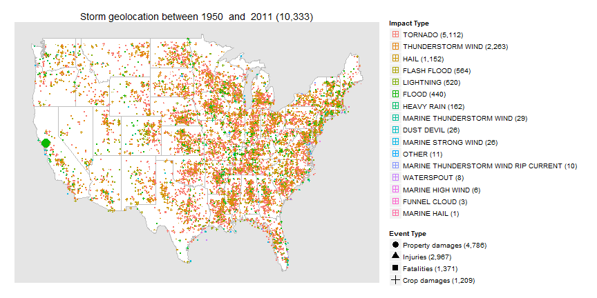

## Why Stormap?

Storms and other severe weather events can cause both public health (fatalities and injuries) and economic problems (property and crop damages) for communities and municipalities.  Preventing such outcomes to the extent possible is a key concern.  But where to start?

The [U.S. National Oceanic and Atmospheric Administration's (NOAA) Storm Database](https://d396qusza40orc.cloudfront.net/repdata%2Fdata%2FStormData.csv.bz2) tracks **when** and **where** major storms and weather events occurred in the United States including estimates of **fatalities**, **injuries**, and **property** and **crop damages**.

Clocking at 46+MB, this database is just that: a big database with rows and columns filled with numbers.  Boring, right?

Stormap aims to make a small contribution to the field of data science by making it easier for you to explore this database so you can in turn transform this information into * **insights** *.

--- .class

## I'm sold!  Where do I start?

Stormap is here: https://paspeur.shinyapps.io/stormap/; its main window looks like this:

--- .class

## Got it.  So how do I use it?

Read the documentation! *(that will be the first thing you see)*  But it's really simple:

* Step 0: Click the **Explore!** button on the top of the window:

* Step 1: Narrow down the horizon time, the type of storms, and the impacts of these storms you are interested in:

--- .class

## Et voil&agrave;!  There is no step 2...

Just give it a few seconds for the map to refresh.  Finally, tables at the bottom will highlight the map's key events.  *(note: the map on this slide was actually __generated on the fly__ as the presentation was being "slidified"...)*

 

